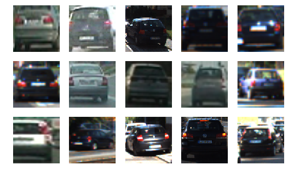
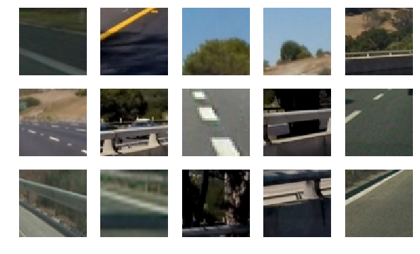
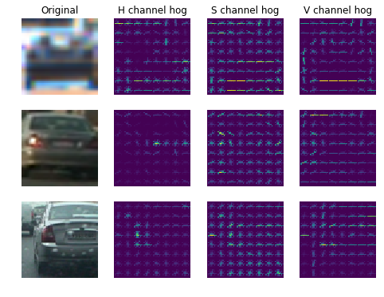
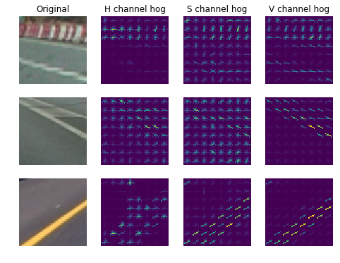
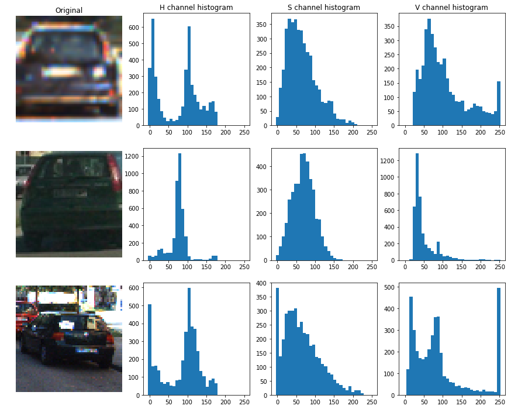
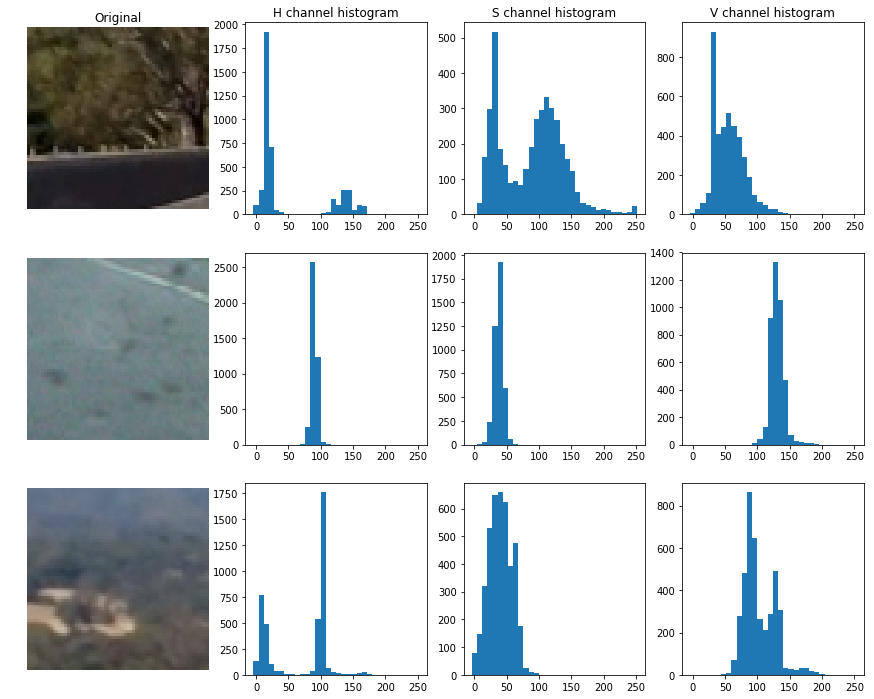
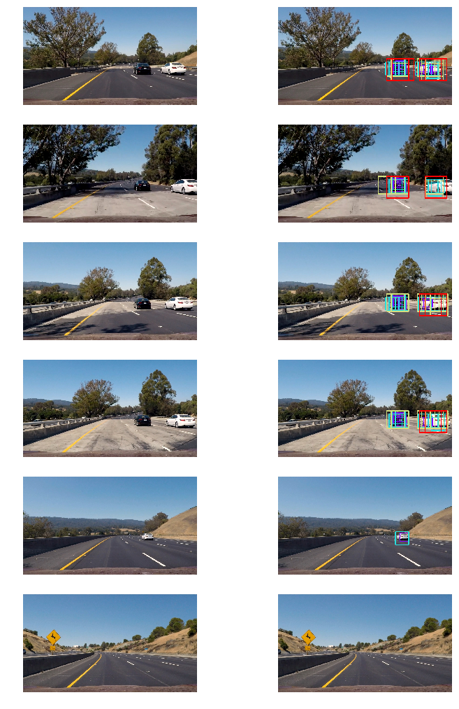
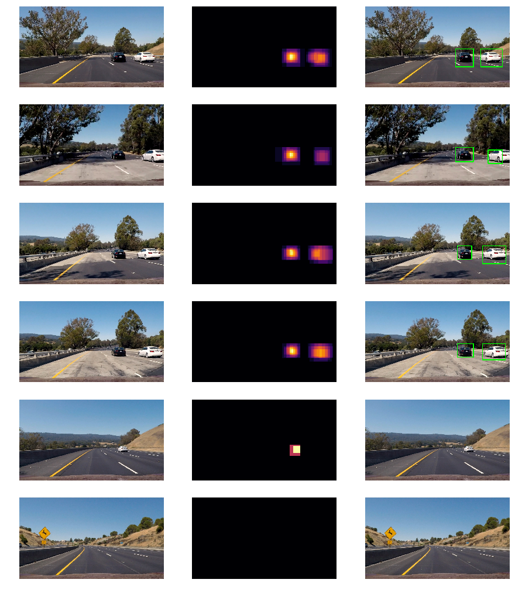

# SVM


```python
import numpy as np
import cv2
import os
import glob
import time
import random
import matplotlib.pyplot as plt
%matplotlib inline
import matplotlib.image as mpimg
from matplotlib import cm
```


```python
# read images
car_imgs = glob.glob("vehicles/*/*.*")
notcar_imgs = glob.glob("non-vehicles/*/*.*")
```


```python
def data_info(images, display=None):
    print("Number of images:", len(images))
    example_img = mpimg.imread(images[0])
    print("Image shape : ", example_img.shape)
    print("Image data type : ", example_img.dtype)
    if display is not None:
        nrows, ncols = display
        n_imgs = nrows * ncols
        images_choose = random.sample(images, n_imgs)
        fix, axes = plt.subplots(nrows, ncols, figsize=(2*ncols, 2*nrows))
        for img,ax in zip(images_choose, axes.flatten()):
            ax.axis('off')
            ax.imshow(mpimg.imread(img))
```

### Vehicles


```python
data_info(car_imgs, display=(3,5))
```

    Number of images: 8792
    Image shape :  (64, 64, 3)
    Image data type :  float32





### Non-vehicles


```python
data_info(notcar_imgs, display=(3,5))
```

    Number of images: 8968
    Image shape :  (64, 64, 3)
    Image data type :  float32





The two classes have roughly the same number of images resulting in a balanced dataset

### Train-test splitting
Randomly splitting data into train and test sets will result in highly correlated images between the two datasets.To remedy the problem, I have decided that images from same track do not end up in both training and test sets.The test data size is fixed to 20%of the full dataset.


```python
from sklearn.model_selection import train_test_split

# split vehicles data by selecting tracks manually for GTI data and randomly for KITTI data 
car_train_indices = []
car_test_indices = []

def split_manual(path, indices):
    start, stop = indices
    img_files = glob.glob(os.path.join(path, "*.*"))
    for f in img_files:
        index = int(f.split("image")[1][:4])
        if start <= index <= stop :
            car_test_indices.append(car_imgs.index(f))
        else :
            car_train_indices.append(car_imgs.index(f))
            
def split_random(path, test_size=0.2):
    img_files = glob.glob(os.path.join(path, "*.*"))
    train,test = train_test_split(img_files, test_size=test_size, random_state=0)
    car_train_indices.extend([car_imgs.index(f) for f in train])
    car_test_indices.extend([car_imgs.index(f) for f in test])
# split GTI vehicles data through manual split  
# split KITTI vehicles data through random split
split_manual("vehicles/GTI_Far/",(0, 142))
split_manual("vehicles/GTI_Left",(148, 344))
split_manual("vehicles/GTI_MiddleClose",(387, 494))
split_manual("vehicles/GTI_Right",(686, 940))
test_size = len(car_test_indices)/(len(car_test_indices)+len(car_train_indices))
split_random("vehicles/KITTI_extracted/", test_size=test_size)
print("The Number of vehicles training images : ", len(car_train_indices))
print("The Number of vehicles testing images : ", len(car_test_indices))
print("Test size is {:2.2f}% of total vehicles dataset".format(100*len(car_test_indices)/(len(car_test_indices)+len(car_train_indices))))
print("="*50)

#split non-vehicles data through random split
img_files = glob.glob(os.path.join("non-vehicles/*/*.*"))
notcar_train_indices, notcar_test_indices = train_test_split(range(len(notcar_imgs)), test_size=test_size, random_state=0)
print("The Number of non-vehicles training images : ", len(notcar_train_indices))
print("The Number of non-vehicles testing images : ",len(notcar_test_indices))
print("Test size is {:2.2f}% of total non-vehicles dataset".format(100*len(car_test_indices)/(len(car_test_indices)+len(car_train_indices))))

```

    The Number of vehicles training images :  6987
    The Number of vehicles testing images :  1805
    Test size is 20.53% of total vehicles dataset
    ==================================================
    The Number of non-vehicles training images :  7127
    The Number of non-vehicles testing images :  1841
    Test size is 20.53% of total non-vehicles dataset


How many features we could get per color channel per orientaions?

* imageSize $(64,64)$
* pizels_per_cell $(8,8)$
* cells_per_block $(2,2)$
* blockSize $(16,16)$
* features : $((64-16)/16+1)^2 * (2*2) = 64$

We could get 64 features per color channel per orientation.


```python
# color in colorspace 
cvtColor = {"RGB"  : cv2.COLOR_BGR2RGB,
            "LUV"  : cv2.COLOR_BGR2LUV,
            "YUV"  : cv2.COLOR_BGR2YUV,
            "HSV"  : cv2.COLOR_BGR2HSV,
            "HLS"  : cv2.COLOR_BGR2HLS,
            "YCrCb": cv2.COLOR_BGR2YCrCb}
# set range for color channels
histRange = {"RGB"   : [(0,256)]*3,
             "YCrCb" : [(0,256)]*3,
             "YUV"   : [(0,256)]*3,
             "HSV"   : [(0,256)]*3,
             "HLS"   : [(0,256)]*3,
             "LUV"   : [(0,192),(0,256),(0,256)]}
# functions for changing between opencv format(BGR) and the default(RGB)
def BGR2RGB(img) :
    return cv2.cvtColor(img, cv2.COLOR_BGR2RGB)
```

### Histogram of Oriented Gradients(HOG)
Perform a Histogram of Oriented Gradients (HOG) feature extraction on a labeled training set of images


```python
from skimage.feature import hog

# function to return HOG features and visualization
def get_hog_features(img, orient, pix_per_cell, cell_per_block, vis=False, feature_vec=True):
    if vis == True:
        features, hog_image = hog(img, orientations=orient, pixels_per_cell=(pix_per_cell,pix_per_cell),
                                  cells_per_block=(cell_per_block, cell_per_block), transform_sqrt=True,
                                  visualize=vis, feature_vector=feature_vec)
        return features, hog_image
    else:
        features = hog(img, orientations=orient, pixels_per_cell=(pix_per_cell,pix_per_cell),
                       cells_per_block=(cell_per_block,cell_per_block), transform_sqrt=True,
                       visualize=vis, feature_vector=feature_vec)
        return features
```

#### Plot HOG features using HSV colorspace with orientations=$9$, pizels_per_cell=$(8,8)$,cells_per_block=$(2,2)$


```python
def hog_features_visualize(data, channels=["R","G","B"], orient=9, pix_per_cell=8, cell_per_block=2, hog_channel="ALL"):
    cvt_color = cvtColor["".join(channels)]
    bins_range = histRange["".join(channels)]
    imgs = random.sample(data,3)
    fig, axes = plt.subplots(3,4,figsize=(8,6))
    for ax in axes.flatten():
        ax.axis('off')
    for img,ax in zip(imgs,axes):
        image = cv2.imread(img)
        ax[0].imshow(BGR2RGB(image))
        image = cv2.cvtColor(image, cvt_color)
        for i in range(image.shape[2]):
            channel = np.maximum(image[:,:,i],0)
            features, hog_image = get_hog_features(channel, orient, pix_per_cell,
                                                  cell_per_block, vis=True, feature_vec=False)
            ax[i+1].imshow(hog_image)
    axes[0][0].set_title('Original')
    for i in range(3) :
        axes[0][i+1].set_title(channels[i]+' channel hog')    
```


```python
hog_visualize = hog_features_visualize(car_imgs, ["H","S","V"], 9, 8, 2)
```

    /Users/jiahuiwang/anaconda3/lib/python3.6/site-packages/skimage/feature/_hog.py:150: skimage_deprecation: Default value of `block_norm`==`L1` is deprecated and will be changed to `L2-Hys` in v0.15. To supress this message specify explicitly the normalization method.
      skimage_deprecation)





```python
hog_visualize = hog_features_visualize(notcar_imgs, ["H","S","V"], 9, 8, 2)
```

    /Users/jiahuiwang/anaconda3/lib/python3.6/site-packages/skimage/feature/_hog.py:150: skimage_deprecation: Default value of `block_norm`==`L1` is deprecated and will be changed to `L2-Hys` in v0.15. To supress this message specify explicitly the normalization method.
      skimage_deprecation)





#### Extract HOG features and Train SVM classifiers


```python
from sklearn.svm import LinearSVC
from sklearn.preprocessing import StandardScaler
# extract color channels features
def extract_features(imgs, cvt_color, orient, pix_per_cell, cell_per_block, hog_channel):
    features = []
    for file in imgs:
        image = cv2.imread(file)
        feature_image = cv2.cvtColor(image, cvt_color)
        if hog_channel == 'ALL':
            hog_features = []
            for channel in range(feature_image.shape[2]):
                hog_features.append(get_hog_features(feature_image[:,:,channel], 
                                    orient, pix_per_cell, cell_per_block, 
                                    vis=False, feature_vec=True))
            hog_features = np.ravel(hog_features)        
        else:
            hog_features = get_hog_features(feature_image[:,:,hog_channel], orient, 
                        pix_per_cell, cell_per_block, vis=False, feature_vec=True)
        # Append the new feature vector to the features list
        features.append(hog_features)
    return np.array(features)
def train_SVM(cvt_color=cvtColor["RGB"], orient=9, pix_per_cell=8, cell_per_block=2, hog_channel="ALL", debug=True):
    # extract vehicles and non-vehicles features 
    # calculate time about extract features
    t1 = time.time()
    car_features = extract_features(car_imgs, cvt_color, orient, pix_per_cell, cell_per_block, hog_channel=hog_channel)
    notcar_features = extract_features(notcar_imgs, cvt_color, orient, pix_per_cell, cell_per_block, hog_channel=hog_channel)
    t2 = time.time()
    if debug:
        print('Time to extract HOG features ', round(t2-t1, 2))
    # Split training and test datasets
    standard_scaler = StandardScaler()
    X_train = np.vstack((car_features[car_train_indices], notcar_features[notcar_train_indices])).astype(np.float64)
    X_train = standard_scaler.fit_transform(X_train)
    X_test = np.vstack((car_features[car_test_indices], notcar_features[notcar_test_indices])).astype(np.float64)
    X_test = standard_scaler.fit_transform(X_test)
    y_train = np.hstack((np.ones(len(car_train_indices)), np.zeros(len(notcar_train_indices))))
    y_test = np.hstack((np.ones(len(car_test_indices)), np.zeros(len(notcar_test_indices))))
    
    if debug :
        print('Using:', orient, 'orientations', pix_per_cell, 'pix_per_cell', cell_per_block, 'cell_per_block')
        print('Feature vector length:', len(X_train[0]))
    # using linear SVC
    svc = LinearSVC()
    # calculate the time of training
    t1 = time.time()
    svc.fit(X_train, y_train)
    t2 = time.time()
    if debug:
        print('Time to train SVC : ', round(t2-t1, 2))
    print('Test Accuracy : ', round(svc.score(X_test, y_test), 5))
    if debug:
        # Calculate the time of predicting
        n_predict = 10
        t1 = time.time()
        sample = random.sample(range(len(y_test)), n_predict)
        print('SVC Predicts: ', svc.predict(X_test[sample]))
        t2 = time.time()
        print('For ', n_predict, 'labels: ', y_test[sample])
        print('Time to predict : ', round(t2-t1, 5))
```


```python
train_SVM(cvtColor['HSV'], 9, 8, 2, "ALL", True)
```

    /Users/jiahuiwang/anaconda3/lib/python3.6/site-packages/skimage/feature/_hog.py:150: skimage_deprecation: Default value of `block_norm`==`L1` is deprecated and will be changed to `L2-Hys` in v0.15. To supress this message specify explicitly the normalization method.
      skimage_deprecation)


    Time to extract HOG features  163.38
    Using: 9 orientations 8 pix_per_cell 2 cell_per_block
    Feature vector length: 5292
    Time to train SVC :  22.22
    Test Accuracy :  0.98217
    SVC Predicts:  [0. 1. 0. 0. 0. 1. 0. 0. 1. 1.]
    For  10 labels:  [0. 1. 0. 0. 0. 1. 0. 0. 1. 1.]
    Time to predict :  0.00238


#### Run the linear SVM classifier for each colorspace and select the colorspace that will have the highest test set accuracy


```python
for color_space in cvtColor :
    print("="*50)
    print("Color space : ", color_space)
    train_SVM(cvtColor[color_space], 9, 8, 2, "ALL", debug=False)
```

    ==================================================
    Color space :  RGB


    /Users/jiahuiwang/anaconda3/lib/python3.6/site-packages/skimage/feature/_hog.py:150: skimage_deprecation: Default value of `block_norm`==`L1` is deprecated and will be changed to `L2-Hys` in v0.15. To supress this message specify explicitly the normalization method.
      skimage_deprecation)


    Test Accuracy :  0.96325
    ==================================================
    Color space :  LUV
    Test Accuracy :  0.98272
    ==================================================
    Color space :  YUV
    Test Accuracy :  0.98354
    ==================================================
    Color space :  HSV
    Test Accuracy :  0.98217
    ==================================================
    Color space :  HLS
    Test Accuracy :  0.98217
    ==================================================
    Color space :  YCrCb
    Test Accuracy :  0.98546


#### Please find the optimal number of orientations bins that will give the highest test set accuracy


```python
orient_list = [8,9,10,11]
for orient in orient_list :
    print("="*50)
    print("Orientations bins : ", orient)
    train_SVM(cvtColor["YCrCb"], orient, 8, 2, "ALL", debug=False)
```

    ==================================================
    Orientations bins :  8


    /Users/jiahuiwang/anaconda3/lib/python3.6/site-packages/skimage/feature/_hog.py:150: skimage_deprecation: Default value of `block_norm`==`L1` is deprecated and will be changed to `L2-Hys` in v0.15. To supress this message specify explicitly the normalization method.
      skimage_deprecation)


    Test Accuracy :  0.98382
    ==================================================
    Orientations bins :  9
    Test Accuracy :  0.98546
    ==================================================
    Orientations bins :  10
    Test Accuracy :  0.98409
    ==================================================
    Orientations bins :  11
    Test Accuracy :  0.98629


#### Plot color histograms using HSV colorspace for vehicles and non-vehicles datasets using 32 bins.


```python
def bin_spatial(img, size=(32, 32)):
    # cv2.resize是在数组本身的基础上改变其形状，ravel是修改原数组将其转化为一维
    features = cv2.resize(img, size).ravel()
    return features

# function to compute color histogram features  
def color_hist(img, n_bins=32, bins_range=[(0, 256)]*3, visualize=False):
    # np.histogram(a,bins,range,...) a表示input data，bins定义了给定范围的bins的等宽度，range定义了bins的最低和最高度
    channel_hist = [np.histogram(img[:,:,i], bins=n_bins, range=bins_range[i]) for i in range(img.shape[2])]
    bin_edges = [hist[1] for hist in channel_hist]
    channel_hist = [hist[0] for hist in channel_hist]
    hist_features = np.concatenate(channel_hist)
    if visualize :
        return (channel_hist, bin_edges, hist_features) 
    else :
        return hist_features
```


```python
def color_features_visualize(data, channels=["R","G","B"], n_bins=32) :
    cvt_color = cvtColor["".join(channels)]
    bins_range = histRange["".join(channels)]
    imgs = random.sample(data,3)
    fig, axes = plt.subplots(3,4,figsize=(15,12))
    for img,ax in zip(imgs,axes) :
        image = cv2.imread(img)
        ax[0].imshow(cv2.cvtColor(image, cv2.COLOR_BGR2RGB))
        ax[0].axis('off')
        image = cv2.cvtColor(image, cvt_color)
        bins_range = bins_range
        n_bins=n_bins
        channel_hist, bin_edges, hist_features = color_hist(image, n_bins=n_bins, 
                                                bins_range=bins_range, visualize=True)
        width=[(b[1]-b[0]) for b in bin_edges]
        for i in range(len(channel_hist)):
            ax[i+1].bar(bin_edges[i][:-1],channel_hist[i],width=width[i])
    axes[0][0].set_title('Original')
    for i in range(3) :
        axes[0][i+1].set_title(channels[i]+' channel histogram')  
```


```python
color_features_visualize(car_imgs, ["H","S","V"], 32)
```





```python
color_features_visualize(notcar_imgs, ["H","S","V"], 32)
```





#### Plot spatial features for vehicles and non-vehicles datasets


```python
# function to extract features from a list of images
def extract_features(imgs, cvt_color, spatial_size, hist_bins, hist_range):
    
    features = []
    for file in imgs:
        image = cv2.imread(file)
        color_feature_image = cv2.cvtColor(image, cvt_color)   
        spatial_features = bin_spatial(color_feature_image, size=spatial_size)
        hist_features = color_hist(color_feature_image, nbins=hist_bins, bins_range=hist_range)
        # combine all features
        features.append(np.concatenate((spatial_features, hist_features)))
    return np.array(features)


def SVC_color(cvt_color=cvtColor['RGB'], spatial=32, histbin=32, hist_range=[(0, 256)]*3, debug=True) :
    t = time.time()
    car_features = extract_features(car_imgs, cvt_color=cvt_color, spatial_size=(spatial, spatial),
                        hist_bins=histbin, hist_range=hist_range)
    notcar_features = extract_features(notcar_imgs, cvt_color=cvt_color, spatial_size=(spatial, spatial),
                            hist_bins=histbin, hist_range=hist_range)
    t2 = time.time()
    if debug :
        print(round(t2-t, 2), 'Seconds to extract color features...')
    
    X_train = np.vstack((car_features[car_train_indices], 
                         notcar_features[notcar_train_indices])).astype(np.float64)   
    standard_scaler = StandardScaler()
    X_train = standard_scaler.fit_transform(X_train)
    X_test = np.vstack((car_features[car_test_indices], 
                         notcar_features[notcar_test_indices])).astype(np.float64) 
    X_test = standard_scaler.transform(X_test) # use same fit as training data

    # labels vector
    y_train = np.hstack((np.ones(len(car_train_indices)), np.zeros(len(notcar_train_indices))))
    y_test = np.hstack((np.ones(len(car_test_indices)), np.zeros(len(notcar_test_indices))))

    if debug :
        print('Using : ', spatial, ' spatial bins and ', histbin,' histogram bins')
        print('Feature vector length:', len(X_train[0]))
    # Use a linear SVC 
    svc = LinearSVC()
    # Check the training time for the SVC
    t=time.time()
    svc.fit(X_train, y_train)
    t2 = time.time()
    if debug :
        print(round(t2-t, 2), 'Seconds to train SVC...')
    # Check the score of the SVC
    print('Test Accuracy of SVC = ', round(svc.score(X_test, y_test), 4))
    if debug :
        # Check the prediction time for a single sample
        t=time.time()
        n_predict = 10
        sample = random.sample(range(len(y_test)), n_predict)
        print('My SVC predicts: ', svc.predict(X_test[sample]))
        print('For these',n_predict, 'labels: ', y_test[sample])
        t2 = time.time()
        print(round(t2-t, 5), 'Seconds to predict', n_predict,'labels with SVC')
```


```python
SVC_color(cvtColor["YCrCb"], 32, 32, histRange["YCrCb"], True)
```

    50.82 Seconds to extract color features...
    Using :  32  spatial bins and  32  histogram bins
    Feature vector length: 3168
    24.53 Seconds to train SVC...
    Test Accuracy of SVC =  0.9509
    My SVC predicts:  [0. 1. 1. 1. 1. 1. 1. 1. 0. 0.]
    For these 10 labels:  [0. 1. 1. 1. 1. 1. 1. 1. 0. 1.]
    0.00482 Seconds to predict 10 labels with SVC


#### How the test set accuracy changes while including color histogram features or spatial features?


```python
for color_space in cvtColor :
    print("="*50)
    print("Color space : ", color_space)
    SVC_color(cvtColor[color_space], 32, 32, histRange[color_space], False)
```

    ==================================================
    Color space :  RGB
    Test Accuracy :  0.9515
    ==================================================
    Color space :  LUV
    Test Accuracy :  0.9482
    ==================================================
    Color space :  YUV
    Test Accuracy :  0.9493
    ==================================================
    Color space :  HSV
    Test Accuracy :  0.9506
    ==================================================
    Color space :  HLS
    Test Accuracy :  0.9495
    ==================================================
    Color space :  YCrCb
    Test Accuracy :  0.9501


#### please determine the optimal features about the number of spatial bins and number of histogram bins. 


```python
cvt_color = cvtColor["HSV"]
hist_range = histRange["HSV"]

for spatial in [8, 16, 32] :
    for hist_bin in [16, 32, 64] :
        print("="*50)
        print("Number of saptial bins : ", spatial)
        print("Number of color histogram bins : ", hist_bin)
        SVC_color(cvt_color, spatial, hist_bin, hist_range, debug=False)
```

    ==================================================
    Number of saptial bins :  8
    Number of color histogram bins :  16
    Test Accuracy :  0.9605
    ==================================================
    Number of saptial bins :  8
    Number of color histogram bins :  32
    Test Accuracy :  0.9679
    ==================================================
    Number of saptial bins :  8
    Number of color histogram bins :  64
    Test Accuracy :  0.9679
    ==================================================
    Number of saptial bins :  16
    Number of color histogram bins :  16
    Test Accuracy :  0.9515
    ==================================================
    Number of saptial bins :  16
    Number of color histogram bins :  32
    Test Accuracy :  0.9487
    ==================================================
    Number of saptial bins :  16
    Number of color histogram bins :  64
    Test Accuracy :  0.9545
    ==================================================
    Number of saptial bins :  32
    Number of color histogram bins :  16
    Test Accuracy :  0.9438
    ==================================================
    Number of saptial bins :  32
    Number of color histogram bins :  32
    Test Accuracy :  0.9506
    ==================================================
    Number of saptial bins :  32
    Number of color histogram bins :  64
    Test Accuracy :  0.9619


#### Summarize the parameters (colorspace, orientations, pixel per cell, cells per block, color histogram, spatial bins) that give the highest test set accuracy.


```python
from skimage.feature import hog

def get_hog_features(img, orient, pix_per_cell, cell_per_block, 
                        vis=False, feature_vec=True):
    if vis == True:
        features, hog_image = hog(img, orientations=orient, pixels_per_cell=(pix_per_cell, pix_per_cell),
                                  cells_per_block=(cell_per_block, cell_per_block), transform_sqrt=True, 
                                  visualise=vis, feature_vector=feature_vec)
        return features, hog_image
    else:      
        features = hog(img, orientations=orient, pixels_per_cell=(pix_per_cell, pix_per_cell),
                       cells_per_block=(cell_per_block, cell_per_block), transform_sqrt=True, 
                       visualise=vis, feature_vector=feature_vec)
        return features
        
def bin_spatial(img, size=(32, 32)):
    #print(2.1)
    features = cv2.resize(img, size).ravel()
    return features
    
def color_hist(img, nbins=32, bins_range=[(0, 256)]*3, visualize=False):
    channel_hist = [np.histogram(img[:,:,i], bins=nbins, range=bins_range[i]) for i in range(img.shape[2])]
    bin_edges = [hist[1] for hist in channel_hist]
    #bin_centers = (bin_edges[1:]  + bin_edges[:-1])/2
    channel_hist = [hist[0] for hist in channel_hist]
    hist_features = np.concatenate(channel_hist)
    if visualize :
        return (channel_hist, bin_edges, hist_features) 
    else :
        return hist_features

def extract_features(imgs):
    # parameters
    orient=10
    pix_per_cell=8
    cell_per_block=2
    spatial_size=(32, 32)
    hist_bins=64
    color="YCrCb"
    cvt_color = cvtColor[color]
    bins_range = histRange[color]
    
    features = []
    for file in imgs:
        image = cv2.imread(file)
        feature_image = cv2.cvtColor(image, cvt_color)
        # HOG features
        hog_features = []
        for channel in range(feature_image.shape[2]):
            hog_features.append(get_hog_features(feature_image[:,:,channel], 
                                orient, pix_per_cell, cell_per_block, 
                                vis=False, feature_vec=True))
        hog_features = np.ravel(hog_features)
        # spatial and color features
        spatial_features = bin_spatial(feature_image, size=spatial_size)
        hist_features = color_hist(feature_image, nbins=hist_bins, bins_range=bins_range)
        # combine all features
        features.append(np.concatenate((spatial_features, hist_features, hog_features)))
    return np.array(features)
```


```python
from sklearn.model_selection import GridSearchCV
from sklearn.svm import LinearSVC
from sklearn.preprocessing import StandardScaler


t1 = time.time()
car_features = extract_features(car_imgs)
notcar_features = extract_features(notcar_imgs)
t2 = time.time()
print('Time to extract all features : ', round(t2-t1, 2))
# Create an array stack of feature vectors and normalize
standard_scaler = StandardScaler()
X_train = np.vstack((car_features[car_train_indices], 
                         notcar_features[notcar_train_indices])).astype(np.float64)   
X_train = standard_scaler.fit_transform(X_train)
X_test = np.vstack((car_features[car_test_indices], 
                     notcar_features[notcar_test_indices])).astype(np.float64) 
X_test = standard_scaler.transform(X_test) # use same fit as training data

# labels vector
y_train = np.hstack((np.ones(len(car_train_indices)), np.zeros(len(notcar_train_indices))))
y_test = np.hstack((np.ones(len(car_test_indices)), np.zeros(len(notcar_test_indices))))

print('Feature vector length:', len(X_train[0]))
# Use a linear SVC 
clf = GridSearchCV(LinearSVC(), param_grid={'C':np.logspace(-3,-2,5)})
# Check the training time for the SVC
t1 = time.time()
clf = clf.fit(X_train, y_train)
t2 = time.time()
print('Time to extract all features : ', round(t2-t1, 2))
print("CV results : ", clf.best_estimator_)

# Check the score of the SVC
print('Test Accuracy : ', round(clf.score(X_test, y_test), 4))
# Check the prediction time for a single sample
t1 = time.time()
n_predict = 10
sample = random.sample(range(len(y_test)), n_predict)
print('My SVC predicts: ', clf.predict(X_test[sample]))
print('For these',n_predict, 'labels: ', y_test[sample])
t2 = time.time()
print('Time to predict', round(t2-t1, 5), n_predict,'labels with SVC')
```

    /Users/jiahuiwang/anaconda3/lib/python3.6/site-packages/skimage/feature/_hog.py:150: skimage_deprecation: Default value of `block_norm`==`L1` is deprecated and will be changed to `L2-Hys` in v0.15. To supress this message specify explicitly the normalization method.
      skimage_deprecation)
    /Users/jiahuiwang/anaconda3/lib/python3.6/site-packages/skimage/feature/_hog.py:248: skimage_deprecation: Argument `visualise` is deprecated and will be changed to `visualize` in v0.16
      'be changed to `visualize` in v0.16', skimage_deprecation)


    Time to extract all features :  163.55
    Feature vector length: 9144
    Time to extract all features :  176.06
    CV results :  LinearSVC(C=0.001, class_weight=None, dual=True, fit_intercept=True,
         intercept_scaling=1, loss='squared_hinge', max_iter=1000,
         multi_class='ovr', penalty='l2', random_state=None, tol=0.0001,
         verbose=0)
    Test Accuracy :  0.992
    My SVC predicts:  [1. 0. 0. 1. 1. 1. 0. 1. 0. 1.]
    For these 10 labels:  [1. 0. 0. 1. 1. 1. 0. 1. 0. 1.]
    Time to predict 0.00437 10 labels with SVC


#### Please select proper sliding-window searching way (window size and searching region) to locate the car in each frame.


```python
def find_cars(img, ystart, ystop, scale, clf, X_scaler):
    
    # parameters
    orient=10
    pix_per_cell=8
    cell_per_block=2
    spatial_size=(32, 32)
    hist_bins=64
    color="YCrCb"
    cvt_color = cvtColor[color]
    bins_range = histRange[color] 
    
    #img = img.astype(np.float32)/255
    draw_img = np.copy(img)
    
    
    img_tosearch = img[ystart:ystop,:,:]
    img_tosearch = cv2.cvtColor(img_tosearch, cvt_color)
    if scale != 1:
        imshape = img_tosearch.shape
        img_tosearch = cv2.resize(img_tosearch, (np.int(imshape[1]/scale), np.int(imshape[0]/scale)))
    
    ch1 = img_tosearch[:,:,0]
    ch2 = img_tosearch[:,:,1]
    ch3 = img_tosearch[:,:,2]

    # Define blocks and steps as above
    nxblocks = (ch1.shape[1] // pix_per_cell)-1
    nyblocks = (ch1.shape[0] // pix_per_cell)-1 
    nfeat_per_block = orient*cell_per_block**2
    # 64 was the orginal sampling rate, with 8 cells and 8 pix per cell
    window = 64
    nblocks_per_window = (window // pix_per_cell)-1 
    cells_per_step = 2  # Instead of overlap, define how many cells to step
    nxsteps = (nxblocks - nblocks_per_window) // cells_per_step
    nysteps = (nyblocks - nblocks_per_window) // cells_per_step
    
    # Compute individual channel HOG features for the entire image
    hog1 = get_hog_features(ch1, orient, pix_per_cell, cell_per_block, feature_vec=False)
    hog2 = get_hog_features(ch2, orient, pix_per_cell, cell_per_block, feature_vec=False)
    hog3 = get_hog_features(ch3, orient, pix_per_cell, cell_per_block, feature_vec=False)
    
    bbox_list=[]
    for xb in range(nxsteps):
        for yb in range(nysteps):
            ypos = yb*cells_per_step
            xpos = xb*cells_per_step
            # Extract HOG for this patch
            hog_feat1 = hog1[ypos:ypos+nblocks_per_window, xpos:xpos+nblocks_per_window].ravel() 
            hog_feat2 = hog2[ypos:ypos+nblocks_per_window, xpos:xpos+nblocks_per_window].ravel() 
            hog_feat3 = hog3[ypos:ypos+nblocks_per_window, xpos:xpos+nblocks_per_window].ravel() 
            hog_features = np.hstack((hog_feat1, hog_feat2, hog_feat3))

            xleft = xpos*pix_per_cell
            ytop = ypos*pix_per_cell

            # Extract the image patch
            subimg = cv2.resize(img_tosearch[ytop:ytop+window, xleft:xleft+window], (64,64))
          
            # Get color features
            spatial_features = bin_spatial(subimg, size=spatial_size)
            hist_features = color_hist(subimg, nbins=hist_bins, bins_range=bins_range)

            # Scale features and make a prediction
            test_features = X_scaler.transform(np.hstack((spatial_features, hist_features, hog_features)).reshape(1, -1))       
            test_prediction = clf.predict(test_features)
            
            if test_prediction == 1:
                xbox_left = np.int(xleft*scale)
                ytop_draw = np.int(ytop*scale)
                win_draw = np.int(window*scale)
                cv2.rectangle(draw_img,(xbox_left, ytop_draw+ystart),
                              (xbox_left+win_draw,ytop_draw+win_draw+ystart),
                              (0,0,1),6)
                bbox_list.append(((xbox_left, ytop_draw+ystart),
                              (xbox_left+win_draw,ytop_draw+win_draw+ystart)))
    return bbox_list

def draw_boxes(img, bbox_list, color=(0,0,255)):
    for box in bbox_list :
        cv2.rectangle(img, box[0], box[1], color,6)
    return img
    

# sliding window scales and the search y-range
y_range = {1.0 : (380,508), 
           1.5 : (380,572), 
           2.0 : (380,636), 
           2.5 : (380,700)} 
```


```python
test_imgs = glob.glob("test_images/*.jpg")
nrows = len(test_imgs)
ncols = 2
fig, axes = plt.subplots(nrows, ncols, figsize=(6*ncols, 3*nrows))
for ax in axes.flatten():
    ax.axis('off')
for image, ax in zip(test_imgs, axes):
    img = cv2.imread(image)
    out_img = np.copy(BGR2RGB(img))
    ax[0].imshow(BGR2RGB(img))
    for scale, i_color in zip(y_range.keys(), np.linspace(0,1,4)) :
        ystart,ystop = y_range[scale]
        color = tuple(255*c for c in plt.cm.rainbow(i_color)[:3])
        bbox_list = find_cars(img, ystart, ystop, scale, clf, standard_scaler)
        out_img = draw_boxes(out_img, bbox_list,color)
    ax[1].imshow(out_img)
```

    /Users/jiahuiwang/anaconda3/lib/python3.6/site-packages/skimage/feature/_hog.py:150: skimage_deprecation: Default value of `block_norm`==`L1` is deprecated and will be changed to `L2-Hys` in v0.15. To supress this message specify explicitly the normalization method.
      skimage_deprecation)
    /Users/jiahuiwang/anaconda3/lib/python3.6/site-packages/skimage/feature/_hog.py:248: skimage_deprecation: Argument `visualise` is deprecated and will be changed to `visualize` in v0.16
      'be changed to `visualize` in v0.16', skimage_deprecation)





```python
def add_heat(heatmap, bbox_list):
    for box in bbox_list:
        heatmap[box[0][1]:box[1][1], box[0][0]:box[1][0]] += 1
    return heatmap
    
def apply_threshold(heatmap, threshold):
    heatmap[heatmap <= threshold] = 0
    return heatmap

def draw_labeled_bboxes(img, labels):
    for car_number in range(1, labels[1]+1):
        nonzero = (labels[0] == car_number).nonzero()
        nonzeroy = np.array(nonzero[0])
        nonzerox = np.array(nonzero[1])
        bbox = ((np.min(nonzerox), np.min(nonzeroy)), (np.max(nonzerox), np.max(nonzeroy)))
        cv2.rectangle(img, bbox[0], bbox[1], (0,255,0), 6)
    return img
```


```python
from scipy.ndimage.measurements import label


test_imgs = glob.glob("test_images/*.jpg")
nrows = len(test_imgs)
ncols = 3
fig, axes = plt.subplots(nrows, ncols, figsize=(5*ncols, 3*nrows))
for ax in axes.flatten():
    ax.axis('off')
for image, ax in zip(test_imgs, axes):
    img = cv2.imread(image)
    heat = np.zeros_like(img[:,:,0]).astype(np.float)
    out_img = np.copy(BGR2RGB(img))
    ax[0].imshow(BGR2RGB(img))
    for scale, i_color in zip(y_range.keys(), np.linspace(0,1,len(y_range))) :
        ystart,ystop = y_range[scale]
        bbox_list = find_cars(img, ystart, ystop, scale, clf, standard_scaler)
        out_img = draw_boxes(out_img, bbox_list,color)
        heat = add_heat(heat,bbox_list)
    ax[1].imshow(heat, cmap=plt.cm.inferno)
    heat = apply_threshold(heat,2)  
    heatmap = np.clip(heat, 0, 255)
    labels = label(heatmap)
    draw_img = draw_labeled_bboxes(np.copy(BGR2RGB(img)), labels)
    ax[2].imshow(draw_img)
```

    /Users/jiahuiwang/anaconda3/lib/python3.6/site-packages/skimage/feature/_hog.py:150: skimage_deprecation: Default value of `block_norm`==`L1` is deprecated and will be changed to `L2-Hys` in v0.15. To supress this message specify explicitly the normalization method.
      skimage_deprecation)
    /Users/jiahuiwang/anaconda3/lib/python3.6/site-packages/skimage/feature/_hog.py:248: skimage_deprecation: Argument `visualise` is deprecated and will be changed to `visualize` in v0.16
      'be changed to `visualize` in v0.16', skimage_deprecation)





```python
video_dim = (1280, 720)

class vehicle_detection :
    def __init__(self, n_iter=25, n_update=2, threshold=8) :
        self.count = 0
        # bboxes for every frame
        self.out_img = None
        # labeled bboxes 
        self.out_img_labeled = None
        # vehicle labels 
        self.labels = [None,0]
        # list of bbox lists from last n iterations
        self.bbox_list_n = [] 
        # number of frames to smooth over
        self.n_iter = n_iter
        # number of frames after which to update detection
        self.n_update = n_update
        # threshold for heat map
        self.threshold = threshold
        # heat map
        self.heat = np.zeros(video_dim[::-1])
        self.heatmap = np.copy(self.heat)
    
    def process_image(self, image) :
        self.count += 1
        self.image=image
        out_img = np.copy(image)
        img = RGB2BGR(image)
        for scale, i_color in zip(y_range.keys(), np.linspace(0,1,len(y_range))) :
            ystart,ystop = y_range[scale]
            bbox_list = find_cars(img, ystart, ystop, scale, clf, standard_scaler)
            color = tuple(255*c for c in plt.cm.rainbow(i_color)[:3])
            self.out_img = draw_boxes(out_img, bbox_list,color)
        self.bbox_list_n.append(bbox_list)
        if self.count%self.n_update == 0 :
            for bbox_list in self.bbox_list_n :
                self.heat = add_heat(self.heat,bbox_list)
            self.heat = apply_threshold(self.heat,self.threshold)
            self.heatmap = np.clip(self.heat, 0, 255)
            self.labels = label(self.heatmap)
            self.heat = np.clip(self.labels[0],0,1)*2
        if len(self.bbox_list_n)>self.n_iter :
            self.bbox_list_n.pop(0)
        self.out_img_labeled = draw_labeled_bboxes(np.copy(image), self.labels)
        return self.out_display()
    

    def out_display(self) :
        imgA = cv2.resize(self.out_img, None, fx=0.4, fy=0.4, interpolation=cv2.INTER_AREA)
        imgB = np.uint8(self.heatmap*255/(0.001+np.max(self.heatmap)))
        imgB = cm.inferno(imgB)[:,:,:3]*255
        imgB = imgB.astype(np.uint8)
        imgB = cv2.addWeighted(imgB, 1, self.image, 0.4, 0)
        imgB = cv2.resize(imgB, None, fx=0.4, fy=0.4, interpolation=cv2.INTER_AREA)
        hA,wA = imgA.shape[:2]
        h_text = int(video_dim[1]/2-hA)
        textA = np.zeros((h_text, wA,3), dtype=np.uint8)
        textB = np.zeros((video_dim[1]-h_text-2*hA, wA,3), dtype=np.uint8)
        textA[:,:,1] = 200
        textB[:,:,1] = 200
        font = cv2.FONT_HERSHEY_SIMPLEX
        cv2.putText(textA,'Bounding boxes',(10,h_text-20), font,1,(0,0,0),3,cv2.LINE_AA)
        cv2.putText(textB,'Heatmap',(10,h_text-20), font,1,(0,0,0),3,cv2.LINE_AA)
        img_combined_right = np.vstack((textA,imgA,textB,imgB))
        return np.hstack((self.out_img_labeled, img_combined_right))
```


```python
def RGB2BGR(img) :
    # convert RGB to BGR
    return cv2.cvtColor(img, cv2.COLOR_RGB2BGR)
```


```python
from moviepy.editor import VideoFileClip
from IPython.display import HTML

vd = vehicle_detection()
output = 'output_video/project_video.mp4'
clip = VideoFileClip("video/test_video.mp4")
clip = clip.fl_image(vd.process_image) #NOTE: this function expects color images!!
%time clip.write_videofile(output, audio=False)
```

    [MoviePy] >>>> Building video output_video/project_video.mp4
    [MoviePy] Writing video output_video/project_video.mp4


     97%|█████████▋| 38/39 [01:15<00:01,  1.38s/it]


    [MoviePy] Done.
    [MoviePy] >>>> Video ready: output_video/project_video.mp4 
    
    CPU times: user 1min 46s, sys: 13.2 s, total: 2min
    Wall time: 1min 18s

